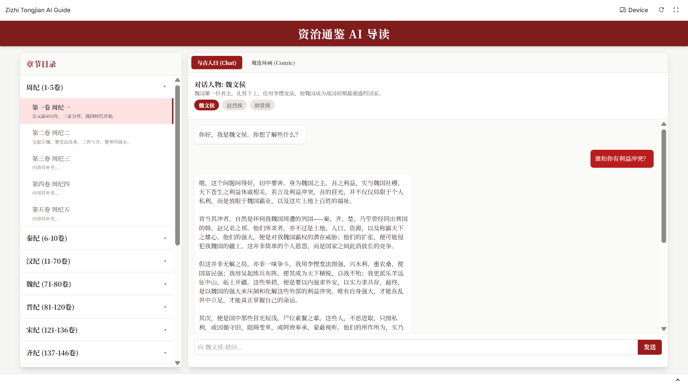

# Zizhi Tongjian AI Guide (资治通鉴 AI 导读)

An interactive web application that allows users to explore the classic Chinese historical text, *Zizhi Tongjian* (资治通鉴). Users can chat with historical figures from each chapter and view AI-generated comic strips that vividly illustrate key scenes.

---

## 中文简介

### 项目概述

**资治通鉴 AI 导读** 是一个创新的Web应用，旨在让古典史籍《资治通鉴》变得更加生动和易于理解。通过结合现代AI技术，用户可以不再仅仅是阅读文字，而是能够身临其境地与书中的历史人物进行对话，并通过AI生成的连环画直观地感受历史事件的场景。本项目致力于为历史爱好者、学生和所有对中国历史感兴趣的人们提供一个全新的互动学习体验。

### 主要功能

1.  **与古人对话 (Interactive Chat)**
    *   选择《资治通鉴》中的任意章节，与该章节的核心历史人物（如魏文侯、吴起等）进行实时对话。
    *   每个人物背后都有由 Gemini API 驱动的独立AI模型，其性格和谈吐均基于史实资料设定，提供沉浸式聊天体验。
    *   深入了解历史人物的所思所想，从不同视角理解复杂的历史事件。

2.  **观连环画 (AI Comic Generation)**
    *   每个章节都配有根据核心事件编写的AI绘画提示词（Prompt）。
    *   利用 Gemini (Imagen) 的图像生成能力，一键生成风格独特的连环画，生动还原历史场景。
    *   将抽象的文字描述转化为具体的视觉图像，增强历史事件的冲击力和记忆点。

3.  **完整的章节目录**
    *   左侧提供完整的《资治通鉴》294卷树状目录结构，按朝代（周纪、秦纪、汉纪等）清晰分类。
    *   目录支持折叠和展开，方便用户快速定位和浏览感兴趣的章节。
    *   界面适应屏幕高度并带有滚动条，提供流畅的导航体验。

### 技术栈

*   **前端框架**: React
*   **样式**: Tailwind CSS
*   **AI模型**: Google Gemini API (`gemini-2.5-flash` 用于聊天, `imagen-4.0-generate-001` 用于图像生成)
*   **语言**: TypeScript

---

## English Introduction

### Project Overview

**Zizhi Tongjian AI Guide** is an innovative web application designed to make the classic historical text *Zizhi Tongjian* more engaging and accessible. By integrating modern AI technology, this application allows users to go beyond mere reading; they can step into history by conversing with its key figures and visualize pivotal moments through AI-generated comic strips. This project aims to provide a novel interactive learning experience for history enthusiasts, students, and anyone interested in Chinese history.

### Key Features

1.  **Interactive Chat with Historical Figures**
    *   Select any chapter from *Zizhi Tongjian* and engage in real-time conversations with its central characters, such as Marquis Wen of Wei or Wu Qi.
    *   Each character is powered by a dedicated AI model via the Gemini API, with personalities and conversational styles meticulously crafted based on historical records for an immersive experience.
    *   Gain deep insights into the thoughts and motivations of historical figures, understanding complex events from multiple perspectives.

2.  **AI-Generated Comic Strips**
    *   Each chapter is accompanied by a carefully written prompt that summarizes a key historical scene.
    *   Leveraging the power of Gemini (Imagen), the application generates unique comic-style illustrations that bring these moments to life.
    *   Transform abstract text into compelling visuals, making history more impactful and memorable.

3.  **Comprehensive Chapter Navigation**
    *   The left sidebar features a complete, tree-structured table of contents for all 294 volumes of the *Zizhi Tongjian*, neatly organized by dynasty (e.g., Zhou, Qin, Han).
    *   The collapsible directory allows users to easily navigate the extensive text and quickly locate chapters of interest.
    *   The UI is responsive, with the navigation panel adapting to the screen height and featuring a scrollbar for a seamless browsing experience.

### Tech Stack

*   **Frontend Framework**: React
*   **Styling**: Tailwind CSS
*   **AI Models**: Google Gemini API (`gemini-2.5-flash` for chat, `imagen-4.0-generate-001` for image generation)
*   **Language**: TypeScript